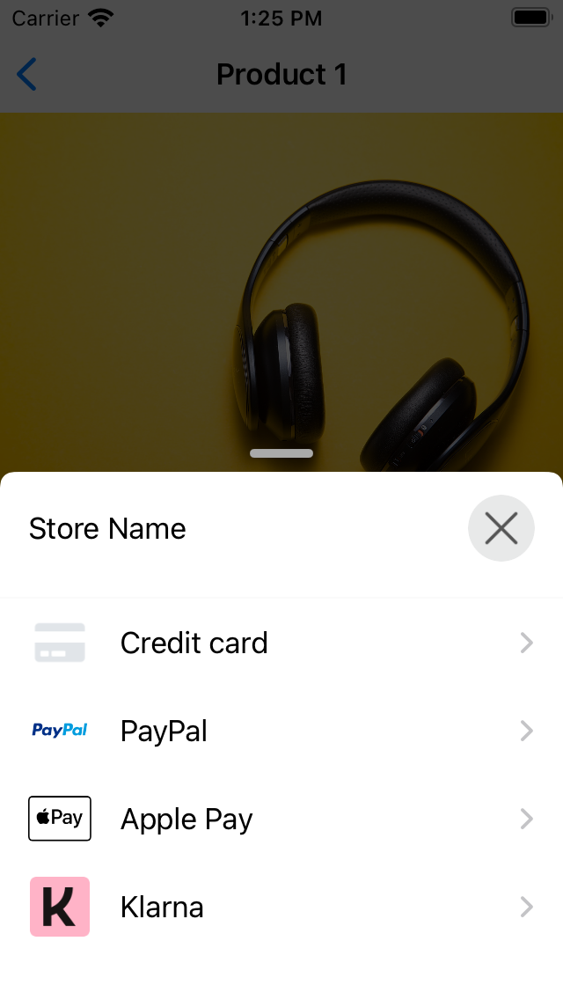
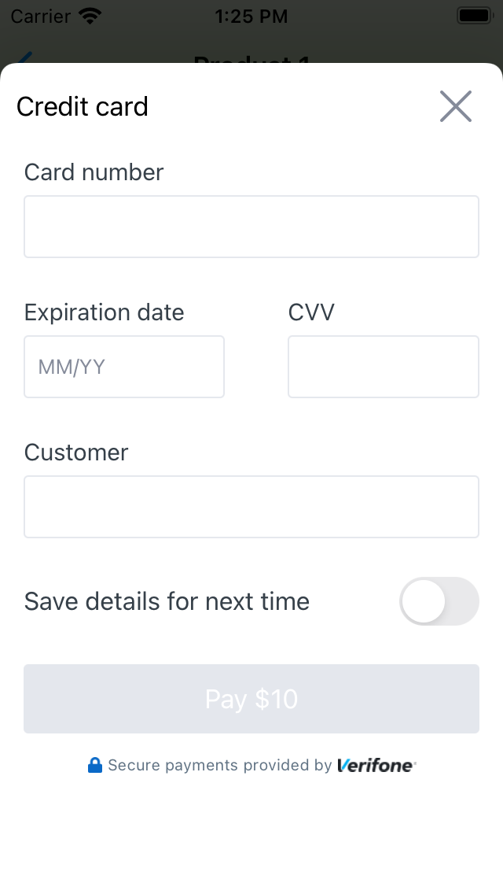
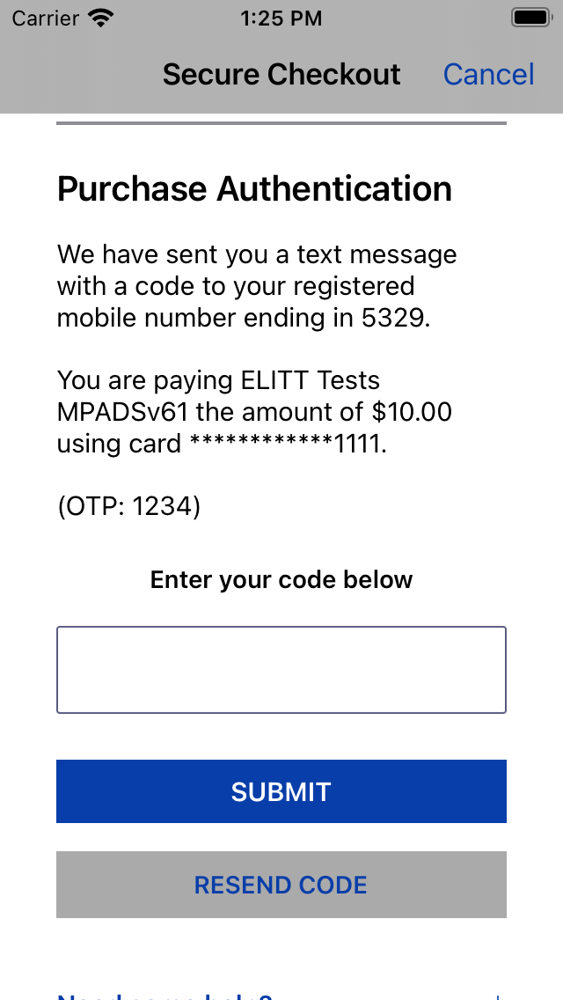
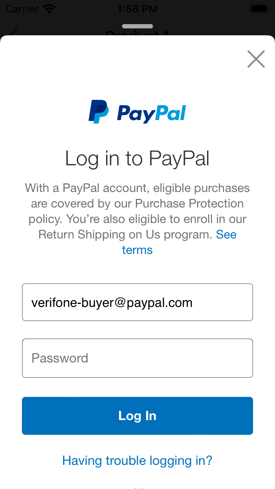
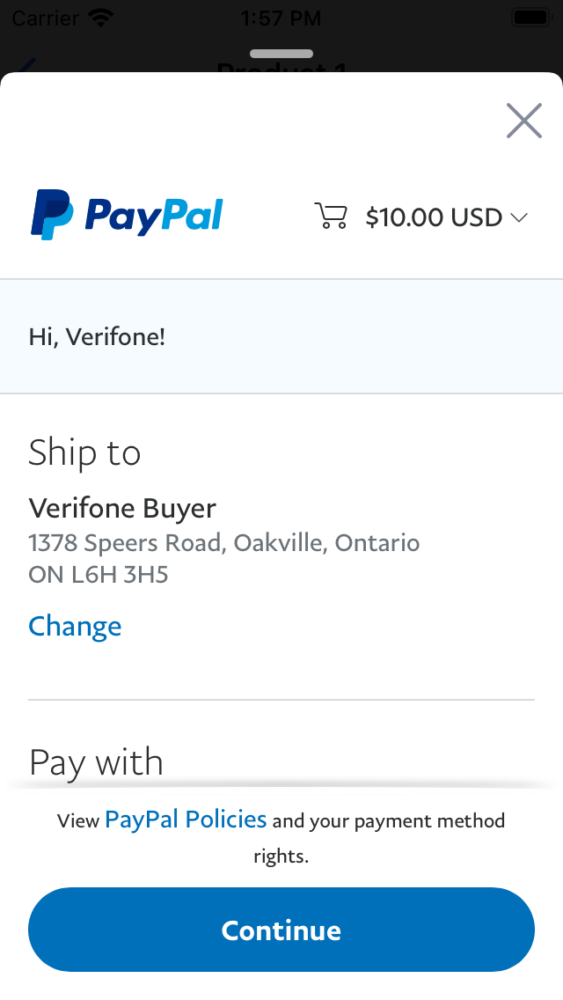
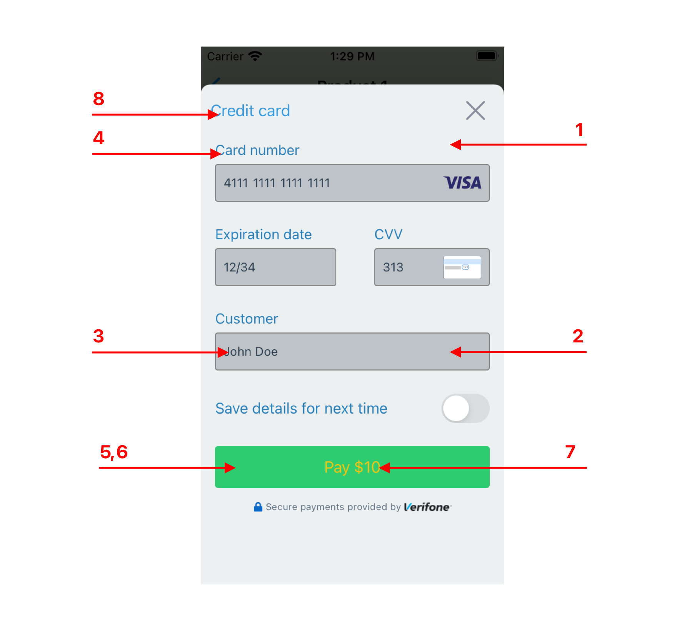

# Verifone iOS SDK

The VerifoneSDK provides encrypting credit cards and 3D Secure verification.

      
    
  
  
  

### Requirements

- Xcode 10.2 or higher
- Swift 5.0 or higher

### Suppported Payment Methods

- Credit Cards
- Paypal
- ThreeDSecure

##### Installation

VerifoneSDK is available through either CocoaPods and Carthage.

##### CocoaPods

1. Add the following line to your Podfile: `pod 'VerifoneSDK'`
2. Run `pod install`

##### Carthage

To integrate the VerifoneSDK into your Xcode project using Carthage, proceed with the following steps:

1. Add the following line to your Cartfile: `github "/"`
2. Run `carthage update --use-xcframeworks`
3. Link the framework with your target as described in [Carthage Readme](https://github.com/Carthage/Carthage#adding-frameworks-to-an-application).

## Usage

Required Parameters to setup the SDK.

```swift
let paymentConfiguration = VerifoneSDK.PaymentConfiguration(
 cardEncryptionPublicKey: "card_encryption_public_key",
 paymentPanelStoreTitle: "store_name", showCardSaveSwitch: "bool", allowedPaymentMethods: [.creditCard, .paypal])

let verifonePaymentForm = VerifonePaymentForm(paymentConfiguration: paymentConfiguration)
verifonePaymentForm.displayPaymentForm(from: self) { [weak self] result in
            self?.didCardEncrypted(result)
}
```

###### Localization

Set language in code. By default SDK will use system language.

```swift
VerifoneSDK.locale = Locale(identifier: "en")
```

###### Font

Set font in code. By default SDK will use system font.

```swift
VerifoneSDK.defaultTheme.font = UIFont(name: "Helvetica", size: 15)
```

###### Transaction flow without threed secure.

A simple completion handler for encrypted card data looks like this. Here we will check ```verifoneResult.paymentMethodType``` which payment method was selected and  if it's credit card type, get encrypted card data to perform transaction request to the merchant server

```swift
func didCardEncrypted(_ result: Result<VerifoneFormResult, Error>) {
        switch result {
        case .success(let verifoneResult):
            switch verifoneResult.paymentMethodType {
                case .creditCard:
                    // verifoneResult.cardData: String
                    // verifoneResult.cardBrand: String
                    // verifoneResult.cardHolder: String
                    // verifoneResult.saveCard: Bool
                    // Perform transaction request here
                case .paypal:
                    //
                    // Pay by link payment method selected.
                    // Verify that the payment was redirected to the expected URL 
                    // and make an authorization API call.
                    // If the redirect URL is nil, make an API call to get the approval URL.
                    //
                    if (verifoneResult.paymentAuthorizingResult != nil) {
                        // verifoneResult.paymentAuthorizingResult.redirectedUrl: URL
                        // verifoneResult.paymentAuthorizingResult.queryStringDictionary: NSMutableDictionary
                    } else {
                    }
                default: break
            }
        case .failure(let error):
            verifonePaymentForm = nil
            let error = error as NSError?
            // Here we can catch all possible errors
            switch error {
            case VerifoneError.cancel:
                print("The form closed or cancelled by user")
            case VerifoneError.invalidCardData:
                print("Missing card encryption public Key")
            default:
                self.stopAnimation()
                print(error!)
            }
        }
    }
```

Transaction flow with threed secure.

1. Initialize threeds manager.
2. Create the threeds JWT.
3. Use the JWT to setup the threeds, on completion threeds our sdk returns the device ID.
4. Use the device ID and encrypted card to perform lookup request.
5. Continue the threed secure authentication, using the payload and transaction ID returned from the lookup request.
6. If the authentication is successfull, we can validate the JWT and perform the transaction.

```swift
let verifoneThreedsManager = Verifone3DSecureManager(environment: Environment.sandbox)

func didCardEncrypted(_ result: Result<VerifoneFormResult, Error>) {
        switch result {
        case .success(let verifoneResult):
             switch verifoneResult.paymentMethodType {
                case .creditCard:
                    // verifoneResult.cardData: String
                    // verifoneResult.cardBrand: String
                    // verifoneResult.cardHolder: String
                    // verifoneResult.saveCard: Bool
                    self.verifoneThreedsManager.setup(with: "jwt", completion: { deviceID in
                        // Set transaction id and payload parameters to continue session
                        self.verifoneThreedsManager.complete3DSecureValidation(with: "transaction_id", payload:"payload") { serverJwt in
                            // Validate authorization and request transaction.
                        } didFailed: {
                            // Handle failure
                        }
                    }, failure: { cardinalResponse in
                        // Handle cardinal setup failure.
                    })
                case .paypal:
                    //
                    // Pay by link payment method selected.
                    // Verify that the payment was redirected to the expected URL
                    // and make an authorization API call.
                    // If the redirect URL is nil, make an API call to get the approval URL.
                    //
                    if (verifoneResult.paymentAuthorizingResult != nil) {
                        // verifoneResult.paymentAuthorizingResult.redirectedUrl: URL
                        // verifoneResult.paymentAuthorizingResult.queryStringDictionary: NSMutableDictionary
                    } else {
                    }
                default: break
            }
        case .failure(let error):
            verifonePaymentForm = nil
            let error = error as NSError?
            // Here we can catch all possible errors
            switch error {
            case VerifoneError.cancel:
                print("The form closed or cancelled by user")
            case VerifoneError.invalidCardData:
                print("Missing card encryption public Key")
            default:
                self.stopAnimation()
                print(error!)
            }
        }
    }
```

### Customize the card form

Configure default theme properties for a credit card form.

```swift 
VerifoneSDK.defaultTheme.primaryBackgroundColor = UIColor.grey
```

List of properties for customizing the credit card form.

N | PROPERTY NAME | DESCRIPTION  
| --- | --- | --- |  
1 | primaryBackgorundColor | Card form view background color |
2 | textfieldBackgroundColor | Background color for any text fields in a card form |
3 | textfieldTextColor | Text color for any text fields in a card form |
4 | labelColor | Text color for any labels in a card form |
5 | payButtonBackgroundColor | Pay button background color |
6 | payButtonDisabledBackgroundColor | Pay button background color for disabled state |
7 | payButtonTextColor | Pay button text color |
8 | cardTitleColor | Card form title color |

  

